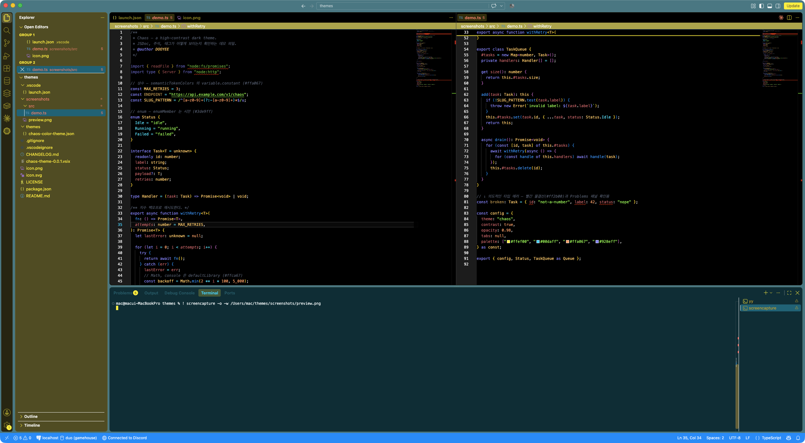

<div align="center">

# Chick Chaos

**A high-contrast dark theme.
Pure black editor, olive sidebar, teal terminal.**

</div>



## Why this exists

I look at VS Code more than I look at my own wallpaper.

None of the themes I tried actually held my eye. I wanted color with some sting
to it — something that catches my attention and keeps it on the editor, instead
of letting it drift off to another browser tab.

So I made this one.

It's a theme for me, really. But I figured there might be other people like me,
so here it is. Give it a try, just for fun. I'm happy with it, at least.

## Fair warning

I don't think this qualifies as a calm theme.

The sidebar is olive, the terminal is teal, and the editor is pure black with
nothing softening it. If you want something muted that disappears into the
background, there are much better options than this one.

## The palette

**Workbench**

| | | |
|---|---|---|
| Editor | `#000000` | pure black, no compromise |
| Sidebar | `#5a5620` | olive |
| Activity bar | `#2c2a0d` | darker olive |
| Panel & terminal | `#00343d` | deep teal |
| Active tab | `#113f47` | teal |
| Title bar | `#4b848e` | muted cyan |
| Status bar | `#0099ff` | electric blue |

**Syntax**

| | | |
|---|---|---|
| Keywords | `#928eff` | violet |
| Strings | `#95ff48` | acid green |
| Functions | `#30a2ff` | blue |
| Numbers & constants | `#ffa067` | orange |
| Enum members | `#3de9ff` | cyan |
| Built-ins | `#ffca67` | gold |
| Comments | `#5e687b` | slate, stays out of the way |
| Errors | `#ff2b00` | |
| Warnings | `#ffd100` | |

## Semantic highlighting

Chick Chaos ships semantic token colors, so constants, built-ins and enum
members each get their own color instead of collapsing into one. It's on by
default in VS Code — if you've turned it off, turn it back on for this theme:

```jsonc
{
  "editor.semanticHighlighting.enabled": true
}
```

## Install

1. Open **Extensions** (`Cmd+Shift+X` / `Ctrl+Shift+X`)
2. Search for **Chick Chaos**
3. **Install**
4. `Cmd+K Cmd+T` / `Ctrl+K Ctrl+T` → pick **Chick Chaos**

## Tweaking it

Nothing here is sacred. Override any color in your `settings.json` and it applies
live, no reload:

```jsonc
{
  "workbench.colorCustomizations": {
    "[Chick Chaos]": {
      "sideBar.background": "#3d3a15"
    }
  }
}
```

## Credits

Syntax scopes are derived from
[One Dark Pro](https://github.com/Binaryify/OneDark-Pro) by Binaryify, used under
the MIT License. The colors have been substantially reworked — none of the
workbench palette is shared.

## License

MIT © DOOYEE
